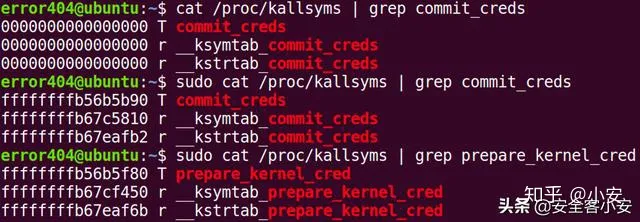

# Kernel Pwn 学习之路(一)

参考链接：[Kernel Pwn 学习之路（一）](https://zhuanlan.zhihu.com/p/140338884)

## 1. 前言

本文主要介绍Kernel的相关知识以及栈溢出在Kernel中的利用。

## 2. Kernel简介

**本部分全文引用了CTF-Wiki的相关内容。**

### 2.1 什么是Kernel

kernel也是一个程序，用来管理软件发出的数据I/O请求，讲这些要求转译为指令，交给CPU和计算机中的其他组件处理，kernel是现代操作系统最基本的部分。

Kernel最主要的功能有以下两点：

- 控制并与硬件进行交互
- 提供application能运行的环境

包括I/O，权限控制，系统调用，进程管理，内存管理等多项功能都可以归结到上边两点中。需要注意的是：**kernel的crash通常会引起重启**

### 2.2 Ring 模型

intel CPU 将CPU的特权级别分为4个级别：Ring 0， Ring1，... ，Ring3。

Ring0只给OS使用，Ring3所有程序都可以使用，内层Ring可以随便使用外层Ring的资源。提升系统安全性

大多数操作系统只使用了Ring0，Ring3。

### 2.3 状态切换

#### User space to kernel space

当发生系统调用，产生异常，外设产生中断等事件时，会发生用户态到内核态的切换，具体过程为：

1. 通过swapgs切换GS段寄存器，将GS寄存器值和一个特定位置的值进行交换，目的是保存GS值，同时将该位置的值作为内核执行的GS值使用。

2. 将当前栈顶（用户控件栈顶）记录在CPU独占变量区域中，将CPU独占区域里记录的内核栈顶放入RSP/ESP

3. 通过push保存各寄存器值，具体代码如下：

   ```assembly
   ENTRY(entry_SYSCALL_64)
   /* SWAPGS_UNSAFE_STACK是一个宏，x86直接定义为swapgs指令 */
   SWAPGS_UNSAFE_STACK
   
   /* 保存栈值，并设置内核栈 */
   movq %rsp, PER_CPU_VAR(rsp_scratch)
   movq PER_CPU_VAR(cpu_current_top_of_stack), %rsp
   
   /* 通过push保存寄存器值，形成一个pt_regs结构 */
   /* Construct struct pt_regs on stack */
   pushq  $__USER_DS                /* pt_regs->ss */
   pushq  PER_CPU_VAR(rsp_scratch)  /* pt_regs->sp */
   pushq  %r11                      /* pt_regs->flags */
   pushq  $__USER_CS                /* pt_regs->cs */
   pushq  %rcx                      /* pt_regs->ip */
   pushq  %rax                      /* pt_regs->orig_ax */
   pushq  %rdi                      /* pt_regs->di */
   pushq  %rsi                      /* pt_regs->si */
   pushq  %rdx                      /* pt_regs->dx */
   pushq  %rcx tuichu               /* pt_regs->cx */
   pushq  $-ENOSYS                  /* pt_regs->ax */
   pushq  %r8                       /* pt_regs->r8 */
   pushq  %r9                       /* pt_regs->r9 */
   pushq  %r10                      /* pt_regs->r10 */
   pushq  %r11                      /* pt_regs->r11 */
   sub $(6*8), %rsp                 /* pt_regs->bp, bx, r12-15 not saved */
   ```

4. 通过汇编指令判断是否为x32_abi（x32架构的程序）

5. 通过系统调用号，跳到全局变量sys_call_table相应位置继续执行系统调用。

#### kernel space to user space

退出时，流程如下：

1. 通过swapgs恢复GS值
2. 通过sysretq或者iretq恢复到用户空间继续执行。如果iretq还需要给出用户空间的一些信息（CS，eflags/rflags，esp/rsp等）

### 2.4 Syscall系统调用

**系统调用：**指的是用户空间的程序向操作系统内核请求更高权限的服务，比如I/O操作或者进程间通信。系统调用提供用户程序与操作系统间的接口，部分库函数（如scanf，puts等I/O相关函数实际上是对系统调用（eg: read, write）的封装）

系统调用号可以在`/usr/include/x86_64-linux-gnu/asm/unistd_64.h`和`/usr/include/x86_64-linux-gnu/asm/unistd_32.h`查看。

系统调用号查询：`Linux Syscall Reference`和`Linux Syscall64 Reference`

### 2.5 ioctl设备通信

ioctl官方手册(`shell: man 2 ioctl`)

```shell
NAME
       ioctl - control device

SYNOPSIS
       #include <sys/ioctl.h>

       int ioctl(int fd, unsigned long request, ...);

DESCRIPTION
       The ioctl() system call manipulates the underlying device parameters of
       special files.  In particular, many operating characteristics of  char‐
       acter  special  files  (e.g., terminals) may be controlled with ioctl()
       requests.  The argument fd must be an open file descriptor.

       The second argument is a device-dependent request code.  The third  ar‐
       gument  is an untyped pointer to memory.  It's traditionally char *argp
       (from the days before void * was valid C), and will  be  so  named  for
       this discussion.

       An  ioctl() request has encoded in it whether the argument is an in pa‐
       rameter or out parameter, and the size of the argument argp  in  bytes.
       Macros and defines used in specifying an ioctl() request are located in
       the file <sys/ioctl.h>.  See NOTES.

RETURN VALUE
       Usually, on success zero is returned.  A few ioctl() requests  use  the
       return  value  as an output parameter and return a nonnegative value on
       success.  On error, -1 is returned, and errno is set appropriately.

```

可以看出ioctl也是一个系统调用，用于与设备通信。

int ioctl(int fd, unsigned long request, ...) 的第一个参数为打开设备 (open) 返回的 文件描述符，第二个参数为用户程序对设备的控制命令，再后边的参数则是一些补充参数，与设备有关。
**使用 ioctl 进行通信的原因：**

- 操作系统提供了内核访问标准外部设备的系统调用，因为大多数硬件设备只能够在内核空间内直接寻址, 但是当访问非标准硬件设备这些系统调用显得不合适, 有时候用户模式可能需要直接访问设备。
- 比如，一个系统管理员可能要修改网卡的配置。现代操作系统提供了各种各样设备的支持，有一些设备可能没有被内核设计者考虑到，如此一来提供一个这样的系统调用来使用设备就变得不可能了。
- 为了解决这个问题，内核被设计成可扩展的，可以加入一个称为设备驱动的模块，驱动的代码允许在内核空间运行而且可以对设备直接寻址。一个 Ioctl 接口是一个独立的系统调用，通过它用户空间可以跟设备驱动沟通。对设备驱动的请求是一个以设备和请求号码为参数的 Ioctl 调用，如此内核就允许用户空间访问设备驱动进而访问设备而不需要了解具体的设备细节，同时也不需要一大堆针对不同设备的系统调用。

### 2.6 内核态函数调用

相比用户态库函数调用，内核态的函数有了一些变化：

1. printf()变更为**printk()**，但需要注意的是printk()**不一定会把内容显示到终端上，但一定在内核缓冲区里**，可以通过 dmesg 查看效果。
2. memcpy() 变更为**copy_from_user()/copy_to_user()**：copy_from_user() 实现了将用户空间的数据传送到内核空间；copy_to_user() 实现了将内核空间的数据传送到用户空间
3. malloc()变更为**kmalloc()**，内核态的内存分配函数，和malloc()相似，但使用的是 slab/slub 分配器
4. free()变更为**kfree()**，同 kmalloc()

### 2.7 内核权限管理

kernel负责管理进程，因此kernel也记录了进程的权限。kernel中有两个可以方便的改变权限的函数：

```c
int commit_creds(struct cred *new)
struct cred* prepare_kernel_cred(struct task_struct* daemon)
```

**从函数名也可以看出，执行 commit_creds(prepare_kernel_cred(0)) 即可获得 root 权限，0 表示 以 0 号进程作为参考准备新的 credentials。**

更多关于 prepare_kernel_cred 的信息可以参考源码
执行 commit_creds(prepare_kernel_cred(0)) 也是最常用的提权手段，两个函数的地址都可以在 /proc/kallsyms 中查看（较老的内核版本中是 /proc/ksyms）。



注：一般情况下，/proc/kallsyms 的内容需要 root 权限才能查看，若以非root权限查看将显示为0地址。

#### struct cred – 进程权限结构体

内核使用cred结构体记录进程的权限，每个进程中都有一个 cred 结构，这个结构保存了该进程的权限等信息(uid，gid等），如果能修改某个进程的cred，那么也就修改了这个进程的权限。结构体源码如下:

```c
struct cred {
    atomic_t    usage;
#ifdef CONFIG_DEBUG_CREDENTIALS
    atomic_t    subscribers;           /* number of processes subscribed */
    void        *put_addr;
    unsigned    magic;
#define CRED_MAGIC  0x43736564
#define CRED_MAGIC_DEAD 0x44656144
#endif
    kuid_t      uid;                   /* real UID of the task */
    kgid_t      gid;                   /* real GID of the task */
    kuid_t      suid;                  /* saved UID of the task */
    kgid_t      sgid;                  /* saved GID of the task */
    kuid_t      euid;                  /* effective UID of the task */
    kgid_t      egid;                  /* effective GID of the task */
    kuid_t      fsuid;                 /* UID for VFS ops */
    kgid_t      fsgid;                 /* GID for VFS ops */
    unsigned    securebits;            /* SUID-less security management */
    kernel_cap_t    cap_inheritable;   /* caps our children can inherit */
    kernel_cap_t    cap_permitted;     /* caps we're permitted */
    kernel_cap_t    cap_effective;     /* caps we can actually use */
    kernel_cap_t    cap_bset;          /* capability bounding set */
    kernel_cap_t    cap_ambient;       /* Ambient capability set */
#ifdef CONFIG_KEYS
    unsigned char   jit_keyring;       /* default keyring to attach requested
    /* keys to */
    struct key __rcu *session_keyring; /* keyring inherited over fork */
    struct key  *process_keyring;      /* keyring private to this process */
    struct key  *thread_keyring;       /* keyring private to this thread */
    struct key  *request_key_auth;     /* assumed request_key authority */
#endif
#ifdef CONFIG_SECURITY
    void        *security;             /* subjective LSM security */
#endif
    struct user_struct *user;          /* real user ID subscription */
    struct user_namespace *user_ns;    /* user_ns the caps and keyrings are relative to. */
    struct group_info *group_info;     /* supplementary groups for euid/fsgid */
    struct rcu_head rcu;               /* RCU deletion hook */
} __randomize_layout;
```

### 2.8 内核保护机制

1. **smep**: Supervisor Mode Execution Protection，当处理器处于 ring 0 模式，执行**用户空间**的代码会触发页错误。（在 arm 中该保护称为 PXN)
2. **smap**: Superivisor Mode Access Protection，类似于 smep，当处理器处于 ring 0 模式，访问**用户空间**的数据会触发页错误。
3. **MMAP_MIN_ADDR**：控制着mmap能够映射的最低内存地址，防止用户非法分配并访问低地址数据。
4. **KASLR**：Kernel Address Space Layout Randomization(内核地址空间布局随机化)，开启后，允许kernel image加载到VMALLOC区域的任何位置。

注：Canary, DEP, PIE, RELRO 等保护与用户态原理和作用相同。

## 3. LKM介绍

#### 3.1 LKM

LKM（Loadable Kernel Modules）称为可加载核心模块（内核模块），其可以看作是运行在内和空间的可执行程序，包括：

- 驱动程序（Device drivers）设备驱动文件系统驱动...
- 内核扩展模块（Modules）

LKMs的文件格式和用户态的可执行程序相同，Linux下位ELF，可以使用IDA工具来分析。

模块记忆单独编译，但不能单独运行。它在运行时被链接到内核作为内核的一部分在内核空间运行，这与运行在用户空间的进程不同。

模块通常用来实现一种文件系统，一个驱动程序或者其他内核上层的功能。

Linux内核之所以提供模块机制，是因为它本身是一个宏内核（monolithic kernel）。优 点是效率高，都在内核空间运行，缺点时可扩展性和可维护性相对较差，模块机制0     就是为了弥补这一缺陷。

**通常情况下，Kernel漏洞的发生也常见于加载的LKMs出现问题。**

内核模块的相关指令：`insmod`, `rmmod`, `lsmod`, `modprobe`

#### 3.2 file_operations 结构体

用户进程在对设备文件进行诸如read/write操作时，**系统调用通过设备文件的主设备号找到设备驱动程序，然后读取这个数据结构相应的函数指针，接着把控制权交给该函数，这是Linux的设备驱动程序工作的基本原理**。

内核模块程序的结构中包括一些[callback回调表](https://zhuanlan.zhihu.com/p/627181746)，对应的函数存储在一个file_operation(fop)结构体中，这也是相当重要的结构体，结构体中实现了的回调函数就会静态初始化函数地址，而未实现的函数，值为NULL。

例如：

```c
/*
Events	User 	functions			Kernel functions
Load	insmod	module_init()
Open	fopen	file_operations: 	open
Read	fread	file_operations: 	read
Write	fwrite	file_operations: 	write
Close	fclose	file_operations: 	release
Remove	rmmod	module_exit()
*/
#include <linux/init.h>
#include <linux/module.h>
#include <linux/kernel.h>
MODULE_LICENSE("Dual BSD/GPL");
static int hello_init(void) 
{
    printk("<1> Hello world!n");
    return 0;
}
static void hello_exit(void) 
{
    printk("<1> Bye, cruel worldn");
}
module_init(hello_init);
module_exit(hello_exit);
struct file_operations module_fops = 
{
    read: module_read,
    write: module_write,
    open: module_open,
    release: module_release
};

```

其中，module_init/module_exit是在载入/卸载这个驱动时自动运行；而fop结构体实现了如上四个callback，冒号右侧的函数名是由开发者自己起的，在驱动程序载入内核后，其他用户程序程序就可以借助**文件方式**像进行系统调用一样调用这些函数实现所需功能。

## 环境配置

不同于用户态的pwn，Kernel-Pwn不再是用python远程链接打payload拿shell，而是给你一个环境包，下载后qemu本地起系统。对于一个Kernel-Pwn来说，题目通常会给定以下文件：
**boot.sh:** 一个用于启动 kernel 的 shell 的脚本，多用 qemu，保护措施与 qemu 启动参数有关；**bzImage**: kernel binary；**rootfs.cpio**: 文件系统映像
**qemu 启动的参数：**

- -initrd rootfs.cpio，使用 rootfs.cpio 作为内核启动的文件系统
- -kernel bzImage，使用 bzImage 作为 kernel 映像
- -cpu kvm64,+smep，设置 CPU 的安全选项，这里开启了 smep
- -m 64M，设置虚拟 RAM 为 64M，默认为 128M 其他的选项可以通过 —help 查看。

本地写好 exploit 后，可以通过 base64 编码等方式把编译好的二进制文件保存到远程目录下，进而拿到 flag。同时可以使用 musl, uclibc 等方法减小 exploit 的体积方便传输。
但是为了我们调试Demo方便，我们最好在本地也编译一个bzImage。

注：部分Kernel漏洞只影响低版本，高版本的Kernel已对脆弱的机制进行了一定程度的遏制乃至进行了消除，但是和Glibc相同，部分中低版本的内核仍有很高的用户量，因此我们对于低版本Kernel的漏洞研究并非是没有意义的，同时，在实际调试Demo时，请特别注意Demo漏洞影响的Kernel版本。